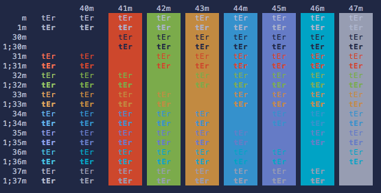
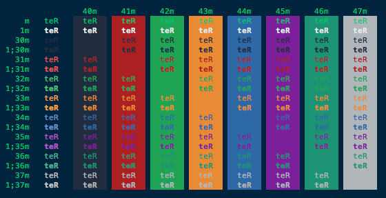

# Themes Mac OS X Terminal.app (mac-terminal-themes)

Themes/Profiles for Mac OS X Terminal.app for personal use.

## Installation Instructions

* Download this repository
* Open `Terminal` app
* Go to `Terminal > Preferences... > Profiles` tab
* From the `Settings` icon on bottom left click `Import...` and then point to the downloaded `themes/` folder to import
* Once imported set it as `Default` and restart `Terminal` app

## Colorful bash prompt

Add the following to your `~/.bash_profile`

    export PS1="\[\033[36m\]\u\[\033[m\]@\[\033[32m\]\h:\[\033[33;1m\]\w\[\033[m\]\$ "
    export CLICOLOR=1
    

## Included Themes

### DarkOne

### DarkFun

### DarkFlat

### Oceanic

